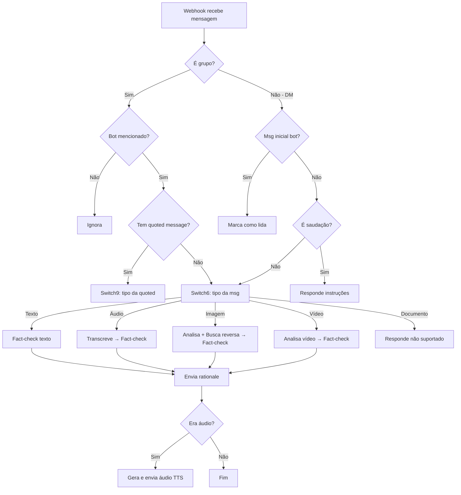

# 🚀 Guia de Implantação — TaCertoIssoAI WhatsApp Bot

Guia completo para colocar o bot de detecção de fake news funcionando.

---

## 📋 Pré-requisitos

- **Python 3.11+**
- **pip** (gerenciador de pacotes)
- **ngrok** (para expor o servidor local — já instalado)
- Conta na **Evolution API**
- Chaves de API: **OpenAI**, **Google Gemini**, **Google Cloud Vision**

---

## 1️⃣ Criar Ambiente Virtual e Instalar Dependências

Python 3.12 usa ambientes gerenciados externamente. É necessário criar um ambiente virtual:

```bash
cd /home/pedrohfsilva/Projects/TaCertoIssoAI/whatsapp-integration

# Criar ambiente virtual
python3 -m venv venv

# Ativar ambiente virtual
source venv/bin/activate

# Instalar dependências
pip install -r requirements.txt
```

> [!TIP]
> Sempre ative o ambiente virtual (`source venv/bin/activate`) antes de rodar o bot ou instalar novas dependências.

---

## 2️⃣ Configurar o Arquivo `.env`

O arquivo `.env` já foi criado com os valores visíveis preenchidos. Você precisa preencher as chaves que estão vazias:

```bash
nano .env
```

### Credenciais necessárias

| Variável | Onde encontrar | Status |
|----------|---------------|--------|
| `EVOLUTION_API_URL` | Screenshot da Evolution API | ✅ Preenchido |
| `EVOLUTION_API_KEY` | Painel da Evolution API → ApiKey | ⬜ Preencher |
| `OPENAI_API_KEY` | [platform.openai.com](https://platform.openai.com/api-keys) | ⬜ Preencher |
| `GOOGLE_GEMINI_API_KEY` | [aistudio.google.com](https://aistudio.google.com/apikey) | ⬜ Preencher |
| `GOOGLE_CLOUD_API_KEY` | Google Cloud Console (ver seção abaixo) | ⬜ Preencher |
| `FACT_CHECK_API_URL` | API do TaCertoIssoAI | ✅ Preenchido |
| `BOT_MENTION_JID` | JID do bot no WhatsApp | ✅ Preenchido |
| `WEBHOOK_PORT` | Porta do servidor local | ✅ Preenchido (5000) |

### Como obter a `GOOGLE_CLOUD_API_KEY`

No n8n, a pesquisa reversa de imagem usa **Google OAuth2** para acessar a **Vision API**. Na nossa implementação Python, simplificamos para usar uma **API Key**, que é mais fácil de configurar.

> [!IMPORTANT]
> A API Key precisa estar no **mesmo projeto Google Cloud** do Gemini, com a **Vision API habilitada**.

1. Acesse o [Google Cloud Console](https://console.cloud.google.com/)
2. Selecione ou crie um projeto
3. Vá em **APIs & Services** → **Enabled APIs** → habilite **Cloud Vision API**
4. Vá em **APIs & Services** → **Credentials** → **Create Credentials** → **API Key**
5. Copie a chave e cole no `.env` como `GOOGLE_CLOUD_API_KEY`

> [!TIP]
> Se você já tem o `GOOGLE_GEMINI_API_KEY` funcionando, provavelmente ele vem do mesmo projeto. Tente usar a mesma chave — se a Vision API estiver habilitada no projeto, funciona!

---

## 3️⃣ Iniciar o Servidor Local

```bash
# Certifique-se de que o venv está ativado
source venv/bin/activate

# Iniciar o servidor
python main.py
```

Você verá:
```
INFO Iniciando servidor na porta 5000...
INFO Uvicorn running on http://0.0.0.0:5000
```

### Verificar que está funcionando

Em outro terminal:
```bash
curl http://localhost:5000/health
# Resposta esperada: {"status":"ok"}
```

---

## 4️⃣ Expor com ngrok

O ngrok cria um túnel público para que a Evolution API possa enviar webhooks para o seu servidor local.

### Primeira vez: autenticar ngrok

Se ainda não configurou, crie uma conta gratuita em [ngrok.com](https://ngrok.com) e configure o token:

```bash
ngrok config add-authtoken SEU_TOKEN_AQUI
```

### Iniciar o túnel

Em outro terminal (mantenha o servidor Python rodando):

```bash
ngrok http 5000
```

Você verá algo como:
```
Forwarding   https://abc123.ngrok-free.app -> http://localhost:5000
```

> [!IMPORTANT]
> Copie a URL **https** (ex: `https://abc123.ngrok-free.app`). Ela será usada no próximo passo.

---

## 5️⃣ Configurar Webhook na Evolution API

Agora você precisa dizer à Evolution API para enviar webhooks para o seu servidor.

### Via Painel da Evolution API

1. Acesse o painel da Evolution API: `https://ta-certo-isso-ai-evolution-api.598vvv.easypanel.host`
2. Vá nas configurações da instância do WhatsApp
3. Em **Webhook**, configure:
   - **URL**: `https://SEU-ID.ngrok-free.app/messages-upsert`
   - **Events**: marque `MESSAGES_UPSERT`
   - **Webhook by Events**: ativado

### Via API (alternativa)

```bash
curl -X POST "https://ta-certo-isso-ai-evolution-api.598vvv.easypanel.host/webhook/set/NOME_DA_INSTANCIA" \
  -H "apiKey: SUA_EVOLUTION_API_KEY" \
  -H "Content-Type: application/json" \
  -d '{
    "url": "https://SEU-ID.ngrok-free.app/messages-upsert",
    "webhook_by_events": true,
    "webhook_base64": true,
    "events": ["MESSAGES_UPSERT"]
  }'
```

> [!WARNING]
> Substitua `NOME_DA_INSTANCIA` pelo nome da sua instância do WhatsApp na Evolution API, e `SUA_EVOLUTION_API_KEY` pela sua API key.

---

## 6️⃣ Testar o Bot

Com tudo configurado:

1. **Servidor Python** rodando (`python main.py`)
2. **ngrok** rodando (`ngrok http 5000`)
3. **Webhook** configurado na Evolution API

### Testes sugeridos

1. **DM com saudação**: Envie "Oi" para o número do bot → deve responder com instruções
2. **DM com texto**: Envie uma notícia para verificar → deve responder com fact-check
3. **DM com áudio**: Envie um áudio → deve transcrever, verificar, e responder com áudio
4. **DM com imagem**: Envie uma imagem → deve analisar e verificar
5. **DM com vídeo**: Envie um vídeo curto (< 2min) → deve analisar e verificar
6. **Grupo com menção**: Mencione o bot em um grupo com `@bot` → deve responder
7. **Documento**: Envie um PDF → deve responder que não suporta documentos

---

## 🗂️ Estrutura do Projeto

```
whatsapp-integration/
├── main.py              ← Servidor FastAPI (webhook endpoint)
├── graph.py             ← LangGraph (fluxo do workflow)
├── config.py            ← Variáveis de ambiente
├── state.py             ← Estado compartilhado do LangGraph
├── requirements.txt     ← Dependências Python
├── .env                 ← Credenciais (NÃO commitar!)
├── .env.example         ← Template de credenciais
├── nodes/
│   ├── __init__.py
│   ├── data_extractor.py   ← Extrai dados do webhook
│   ├── filters.py          ← Lógica de roteamento (grupo, menção, saudação)
│   ├── router.py           ← Roteamento por tipo de mídia (Switch6/Switch9)
│   ├── evolution_api.py    ← Cliente da Evolution API
│   ├── ai_services.py      ← OpenAI + Gemini + Google Vision API
│   ├── media_processor.py  ← Processamento de áudio/imagem/vídeo
│   ├── fact_checker.py     ← Cliente da API de fact-checking
│   └── response_sender.py  ← Envio de respostas
└── n8n/
    ├── n8n-workflow.json     ← Workflow principal original
    ├── analyze-image.json    ← Sub-workflow de análise de imagem
    ├── reverse-search.json   ← Sub-workflow de busca reversa
    ├── digitando.json        ← Sub-workflow de presença "digitando"
    └── gravando.json         ← Sub-workflow de presença "gravando"
```

---

## 🔄 Fluxo do Bot (Resumo)



---

## ⚙️ Mapeamento de Credenciais: N8N → Python

| Credencial N8N | Variável .env | Uso |
|----------------|--------------|-----|
| `Evolution account` (ApiKey) | `EVOLUTION_API_KEY` | Enviar msgs, marcar como lida, presença |
| `OpenAi account` (API Key) | `OPENAI_API_KEY` | Whisper (transcrição), TTS, GPT-4o-mini (imagem) |
| `Google Gemini(PaLM) Api account` | `GOOGLE_GEMINI_API_KEY` | Gemini 2.5 Flash (análise de vídeo) |
| `Google account` (OAuth2) | `GOOGLE_CLOUD_API_KEY` | Vision API WEB_DETECTION (reverse search) |

> [!NOTE]
> O n8n usa **OAuth2** para o Google Cloud Vision API. Na implementação Python, simplificamos para **API Key** que é funcionalmente equivalente sem necessidade de refresh token.

---

## 🛠️ Solução de Problemas

### Bot não responde
1. Verifique se o servidor está rodando: `curl http://localhost:5000/health`
2. Verifique se o ngrok está ativo e a URL não expirou
3. Verifique os logs do terminal para erros
4. Confirme que o webhook está configurado na Evolution API

### Erro de API key
- Verifique se todas as chaves no `.env` estão corretas
- Para Google Cloud: verifique se a Vision API está habilitada no projeto

### Vídeo não é analisado
- Vídeos com mais de 2 minutos são rejeitados (mesmo comportamento do n8n)
- Verifique se o `GOOGLE_GEMINI_API_KEY` está correto

### ngrok expirou
- A URL do ngrok gratuito muda a cada reinício
- Reconfigure o webhook na Evolution API com a nova URL
- Para URL fixa, considere um plano pago do ngrok ou deploy em servidor

---

## 🚀 Deploy em Produção

Para deploy permanente, considere:

1. **Deploy na nuvem** (Google Cloud Run, Railway, etc.)
2. **URL fixa** — sem necessidade de ngrok
3. **Configure o webhook** com a URL fixa do deploy
4. Use `gunicorn` ou `uvicorn` em modo produção:
   ```bash
   uvicorn main:app --host 0.0.0.0 --port 5000 --workers 2
   ```
