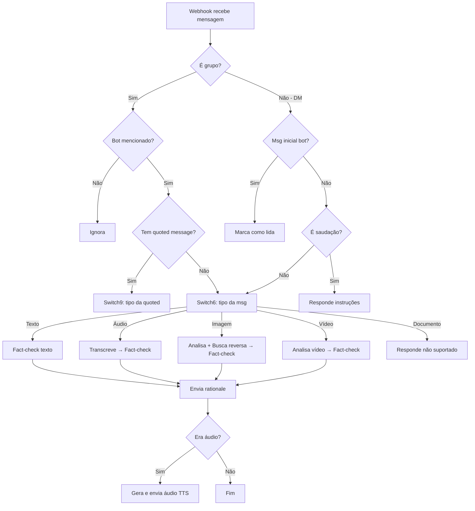

# 🚀 Guia de Implantação — TaCertoIssoAI WhatsApp Bot v5.0.0

Guia completo para colocar o bot de detecção de fake news funcionando na **WhatsApp Business Cloud API** (API Oficial da Meta).

> **Novidades da v5.0.0**:
> - ⚡ **PRIORIDADE ABSOLUTA** ao webhook: Middleware intercepta POST /webhook e retorna 200 OK em **< 1ms**
> - 🚀 **Fire-and-forget**: Enfileiramento em background task (não bloqueia a resposta)
> - 🎯 Tunning para VPS 1-core (3 workers, 8 threads, 10 concurrent)
> - 🛑 Shutdown robusto com lifespan context manager
> - ✅ **GARANTIA**: Meta nunca espera, mesmo com servidor sob alta carga
>
> 📚 **[Leia sobre a arquitetura de prioridade máxima](WEBHOOK_PRIORITY.md)**

---

## 📋 Pré-requisitos

- **Python 3.11+**
- **pip** (gerenciador de pacotes)
- Conta na **WhatsApp Business** (Meta)
- Chave de API: **Google Gemini**

> **Nota**: Esta versão usa a **API Oficial do WhatsApp** (Cloud API da Meta), não mais a Evolution API não-oficial.

---

## 1️⃣ Criar Ambiente Virtual e Instalar Dependências

Python 3.12 usa ambientes gerenciados externamente. É necessário criar um ambiente virtual:

```bash
cd /home/pedrohfsilva/Projects/TaCertoIssoAI/whatsapp-integration

# Criar ambiente virtual
python3 -m venv venv

# Ativar ambiente virtual
source venv/bin/activate

# Instalar dependências
pip install -r requirements.txt
```

> [!TIP]
> Sempre ative o ambiente virtual (`source venv/bin/activate`) antes de rodar o bot ou instalar novas dependências.

---

## 2️⃣ Configurar o Arquivo `.env`

O arquivo `.env` já foi criado com os valores visíveis preenchidos. Você precisa preencher as chaves que estão vazias:

```bash
nano .env
```

### Credenciais necessárias

| Variável | Onde encontrar | Status |
|----------|---------------|--------|
| `WHATSAPP_ACCESS_TOKEN` | Meta for Developers → App → WhatsApp → API Setup | ⬜ Preencher |
| `WHATSAPP_PHONE_NUMBER_ID` | Meta for Developers → WhatsApp → Phone Number ID | ⬜ Preencher |
| `WHATSAPP_VERIFY_TOKEN` | Escolha uma senha qualquer (ex: `meu_token_secreto_123`) | ⬜ Preencher |
| `WHATSAPP_APP_SECRET` | Meta for Developers → App Settings → Basic → App Secret | ⬜ Preencher |
| `GOOGLE_GEMINI_API_KEY` | [aistudio.google.com](https://aistudio.google.com/apikey) | ⬜ Preencher |
| `FACT_CHECK_API_URL` | API do TaCertoIssoAI | ✅ Preenchido |
| `WEBHOOK_PORT` | Porta do servidor local | ✅ Preenchido (5000) |

### Como obter as credenciais do WhatsApp (Meta)

1. Acesse [developers.facebook.com](https://developers.facebook.com/)
2. Crie um app ou use um existente
3. Adicione o produto **WhatsApp** ao app
4. Em **API Setup**, você encontra:
   - **Temporary access token** — copie para `WHATSAPP_ACCESS_TOKEN` (válido por 24h, depois crie um permanente)
   - **Phone number ID** — copie para `WHATSAPP_PHONE_NUMBER_ID`
5. Em **App Settings** → **Basic**:
   - **App Secret** — copie para `WHATSAPP_APP_SECRET`
6. Para `WHATSAPP_VERIFY_TOKEN`: escolha uma senha qualquer (você usará ela ao configurar o webhook)

> **Token permanente**: O temporary token expira em 24h. Para produção, crie um **System User** com token permanente em **Business Settings** → **System Users**.

---

## 3️⃣ Iniciar o Servidor Local

```bash
# Certifique-se de que o venv está ativado
source venv/bin/activate

# Iniciar o servidor
python main.py
```

Você verá:
```
INFO Iniciando servidor na porta 5000...
INFO Uvicorn running on http://0.0.0.0:5000
```

### Verificar que está funcionando

Em outro terminal:
```bash
curl http://localhost:5000/health
# Resposta esperada: {"status":"ok"}
```

---

## 4️⃣ Expor o Webhook Publicamente

A Meta precisa enviar webhooks para o seu servidor. Você tem 3 opções:

### Opção A: ngrok (desenvolvimento local)

```bash
# Em outro terminal (mantenha o servidor Python rodando)
ngrok http 5000
```

Copie a URL **https** (ex: `https://abc123.ngrok-free.app`).

### Opção B: Deploy em servidor VPS

Se você tem uma VPS com IP público:

```bash
# Certifique-se de que a porta 5000 está aberta no firewall
sudo ufw allow 5000
```

Use o IP ou domínio da VPS (ex: `https://meudominio.com`).

### Opção C: Railway, Google Cloud Run, etc.

Deploy em plataforma cloud que fornece URL HTTPS automática.

---

## 5️⃣ Configurar Webhook na Meta

Agora configure a Meta para enviar webhooks para o seu servidor.

1. Acesse [developers.facebook.com](https://developers.facebook.com/) → seu app → **WhatsApp** → **Configuration**
2. Em **Webhook**, clique em **Edit**
3. Preencha:
   - **Callback URL**: `https://SEU-DOMINIO/webhook` (ex: `https://abc123.ngrok-free.app/webhook`)
   - **Verify token**: o mesmo que você colocou em `WHATSAPP_VERIFY_TOKEN` no `.env`
4. Clique em **Verify and Save**
5. Em **Webhook fields**, marque **messages**

> **Importante**: A Meta vai fazer uma requisição GET para `/webhook` com o verify token. O servidor precisa estar rodando!

---

## 6️⃣ Testar o Bot

Com tudo configurado:

1. **Servidor Python** rodando (`python main.py`)
2. **Webhook** configurado na Meta
3. **URL pública** acessível (ngrok ou VPS)

### Testes sugeridos

1. **Saudação**: Envie "Oi" para o número do WhatsApp Business → deve responder com instruções
2. **Texto**: Envie uma notícia para verificar → deve responder com fact-check
3. **Áudio**: Envie um áudio → deve transcrever, verificar, e responder com texto + áudio
4. **Imagem**: Envie uma imagem → deve analisar e verificar
5. **Vídeo**: Envie um vídeo curto → deve analisar e verificar
6. **Documento**: Envie um PDF → deve responder que não suporta documentos

### Verificar métricas

```bash
curl http://localhost:5000/health
```

Resposta esperada:
```json
{
  "status": "ok",
  "version": "5.0.0",
  "workflow_ready": true,
  "queue_size": 0,
  "active_tasks": 0,
  "concurrency": "0/10",
  "total_received": 42,
  "total_processed": 40,
  "total_errors": 2,
  "dedup_cache_size": 35,
  "thread_pool_workers": 8,
  "shutting_down": false
}
```

---

## 🗂️ Estrutura do Projeto

```
whatsapp-integration/
├── main.py              ← Servidor FastAPI (webhook endpoint)
├── graph.py             ← LangGraph (fluxo do workflow)
├── config.py            ← Variáveis de ambiente
├── state.py             ← Estado compartilhado do LangGraph
├── requirements.txt     ← Dependências Python
├── .env                 ← Credenciais (NÃO commitar!)
├── .env.example         ← Template de credenciais
├── nodes/
│   ├── __init__.py
│   ├── data_extractor.py   ← Extrai dados do webhook
│   ├── filters.py          ← Lógica de roteamento (grupo, menção, saudação)
│   ├── router.py           ← Roteamento por tipo de mídia (Switch6/Switch9)
│   ├── evolution_api.py    ← Cliente da Evolution API
│   ├── ai_services.py      ← Google Gemini + Google Vision API
│   ├── media_processor.py  ← Processamento de áudio/imagem/vídeo
│   ├── fact_checker.py     ← Cliente da API de fact-checking
│   └── response_sender.py  ← Envio de respostas
└── n8n/
    ├── n8n-workflow.json     ← Workflow principal original
    ├── analyze-image.json    ← Sub-workflow de análise de imagem
    ├── reverse-search.json   ← Sub-workflow de busca reversa
    ├── digitando.json        ← Sub-workflow de presença "digitando"
    └── gravando.json         ← Sub-workflow de presença "gravando"
```

---

## 🔄 Fluxo do Bot (Resumo)



---

## ⚙️ Mapeamento de Credenciais: N8N → Python

| Credencial N8N | Variável .env | Uso |
|----------------|--------------|-----|
| `Evolution account` (ApiKey) | `EVOLUTION_API_KEY` | Enviar msgs, marcar como lida, presença |
| `Google Gemini(PaLM) Api account` | `GOOGLE_GEMINI_API_KEY` | Gemini (transcrição, imagem, vídeo, TTS) |
| `Google account` (OAuth2) | `GOOGLE_CLOUD_API_KEY` | Vision API WEB_DETECTION (reverse search) |

> [!NOTE]
> O n8n usa **OAuth2** para o Google Cloud Vision API. Na implementação Python, simplificamos para **API Key** que é funcionalmente equivalente sem necessidade de refresh token.

---

## 🛠️ Solução de Problemas

### Bot não responde
1. Verifique se o servidor está rodando: `curl http://localhost:5000/health`
2. Verifique se o ngrok está ativo e a URL não expirou
3. Verifique os logs do terminal para erros
4. Confirme que o webhook está configurado na Evolution API

### Erro de API key
- Verifique se todas as chaves no `.env` estão corretas
- Para Google Cloud: verifique se a Vision API está habilitada no projeto

### Vídeo não é analisado
- Vídeos com mais de 2 minutos são rejeitados (mesmo comportamento do n8n)
- Verifique se o `GOOGLE_GEMINI_API_KEY` está correto

### ngrok expirou
- A URL do ngrok gratuito muda a cada reinício
- Reconfigure o webhook na Evolution API com a nova URL
- Para URL fixa, considere um plano pago do ngrok ou deploy em servidor

---

## 🚀 Deploy em Produção (VPS)

Para deploy permanente em VPS com 1 core:

### 1. Instalar dependências do sistema

```bash
sudo apt update
sudo apt install -y python3.11 python3.11-venv python3-pip ffmpeg
```

### 2. Clonar o repositório e configurar

```bash
git clone https://github.com/TaCertoIssoAI/whatsapp-automation.git
cd whatsapp-automation
python3 -m venv venv
source venv/bin/activate
pip install -r requirements.txt
```

### 3. Configurar `.env` com as credenciais de produção

### 4. Criar serviço systemd

```bash
sudo nano /etc/systemd/system/whatsapp-bot.service
```

Conteúdo:
```ini
[Unit]
Description=TaCertoIssoAI WhatsApp Bot
After=network.target

[Service]
Type=simple
User=seu-usuario
WorkingDirectory=/caminho/para/whatsapp-automation
Environment="PATH=/caminho/para/whatsapp-automation/venv/bin"
ExecStart=/caminho/para/whatsapp-automation/venv/bin/python main.py
Restart=always
RestartSec=10

[Install]
WantedBy=multi-user.target
```

### 5. Ativar e iniciar o serviço

```bash
sudo systemctl daemon-reload
sudo systemctl enable whatsapp-bot
sudo systemctl start whatsapp-bot
sudo systemctl status whatsapp-bot
```

### 6. Configurar NGINX como reverse proxy (opcional mas recomendado)

```nginx
server {
    listen 80;
    server_name seu-dominio.com;

    location / {
        proxy_pass http://127.0.0.1:5000;
        proxy_http_version 1.1;
        proxy_set_header Upgrade $http_upgrade;
        proxy_set_header Connection 'upgrade';
        proxy_set_header Host $host;
        proxy_cache_bypass $http_upgrade;
        proxy_set_header X-Real-IP $remote_addr;
        proxy_set_header X-Forwarded-For $proxy_add_x_forwarded_for;
        proxy_set_header X-Forwarded-Proto $scheme;
    }
}
```

### 7. Configurar HTTPS com Let's Encrypt

```bash
sudo apt install certbot python3-certbot-nginx
sudo certbot --nginx -d seu-dominio.com
```

---

## 📊 Monitoramento

### Ver logs do serviço

```bash
sudo journalctl -u whatsapp-bot -f
```

### Reiniciar o serviço

```bash
sudo systemctl restart whatsapp-bot
```

### Verificar métricas

```bash
curl http://localhost:5000/health | jq
```

---

## ⚠️ Troubleshooting

### Bot não responde
1. Verifique se o servidor está rodando: `sudo systemctl status whatsapp-bot`
2. Verifique os logs: `sudo journalctl -u whatsapp-bot -n 100`
3. Teste o health check: `curl http://localhost:5000/health`
4. Verifique se o webhook está configurado corretamente na Meta

### Mensagens atrasam ou "somem"
- ✅ **RESOLVIDO na v5.0.0**: O webhook agora retorna 200 **instantaneamente** (< 1ms)
- A Meta nunca mais vai colocar seu servidor em "castigo" (exponential backoff)
- Se ainda houver atrasos, verifique a latência da rede entre Meta e seu servidor

### Servidor trava ou usa muita CPU
- v5.0.0 está tunado para VPS 1-core: 3 workers, 10 concurrent, 8 threads
- Se precisar ajustar, edite as constantes no topo de `main.py`

### Erro de API key
- Verifique se todas as chaves no `.env` estão corretas
- Token do WhatsApp expira em 24h — use System User token para produção

---
